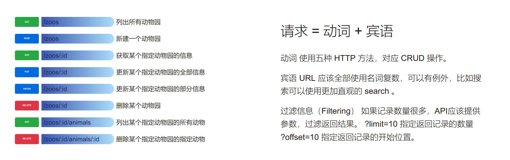
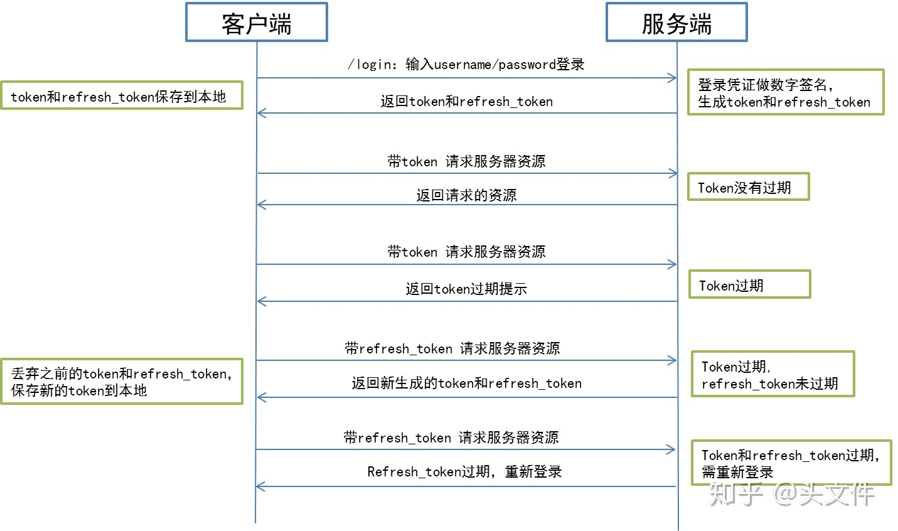

## chiblog - backend

chiblog 的后端desu。

`Flask`+`MongoDB`。

## RESTful说明

### 服务器回应数据

客户端请求时，要明确告诉服务器，接受 JSON 格式，请求的 HTTP 头的 ACCEPT 属性要设成 `application/json`。

服务端返回的数据，不应该是纯文本，而应该是一个 JSON 对象。服务器回应的 HTTP 头的 Content-Type 属性要设为 `application/json`。

错误处理 如果状态码是4xx，就应该向用户返回出错信息。一般来说，返回的信息中将 error 作为键名，出错信息作为键值即可。 `{error: "Invalid API key"}`。

认证 RESTful API 应该是无状态，每个请求应该带有一些认证凭证。推荐使用 JWT 认证，并且使用 SSL。

Hypermedia 即返回结果中提供链接，连向其他API方法，使得用户不查文档，也知道下一步应该做什么。

### JWT认证

## 后端功能规划

1. `content`内容管理
   1. 发布内容
   2. 修改内容的全部信息
   3. 修改内容的部分信息
   4. 删除内容
   5. `comments`评论管理
      1. 列出评论
      2. 发布评论
      3. 修改评论的全部信息
      4. 修改评论的部分信息
      5. 删除评论
   6. `stats`数据管理
2. `users`用户管理
   1. 获取用户列表
   2. 获取用户信息
   3. 注册用户
   4. 更新用户信息
   5. 删除用户
3. `session`会话管理
   1. 用户登录（得到`access_token`和`refresh_token`）
   2. 获取会话信息（更新`accsess_token`）
   3. 退出登录

## 数据库规划

1. `user`：
   1. `cid`：ID
   2. `username`：用户名
   3. `nick`：昵称（显示名字）
   4. `created_at`：创建于
   5. `updated_at`：更新于
   6. `level`：权限等级
   7. `state`：状态：[`normal`, `verifying`, `banned`, `deleted`]
   8. `last_active`：上次活跃
   9. `profile`：个人资料
      1. `contact`
         1. `github`
         2. `emial`
         3. `xxxxx`
2. `session`
   1. `uid`
   2. `password`
   3. `created_at`：创建于
   4. `updated_at`：更新于
   5. `last_login`：上次登录
3. `content`
   1. `cid`
   2. `title`
   3. `author`：作者的`username`，`POST`的时候用用户`uid`，返回时被`user`表内容覆盖
   4. `content`
   5. `created_at`：创建于
   6. `updated_at`：更新于
   7. `password`：需要密码才能阅读
   8. `level`：低于此等级不能阅读